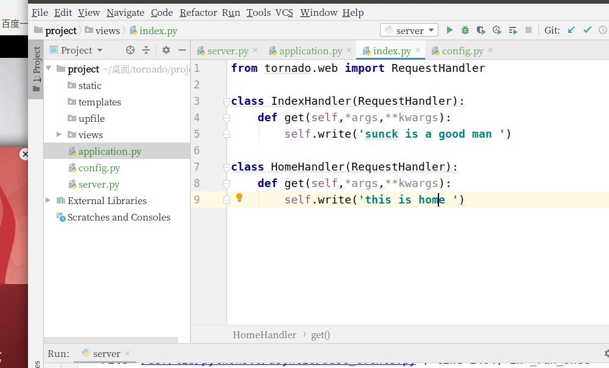
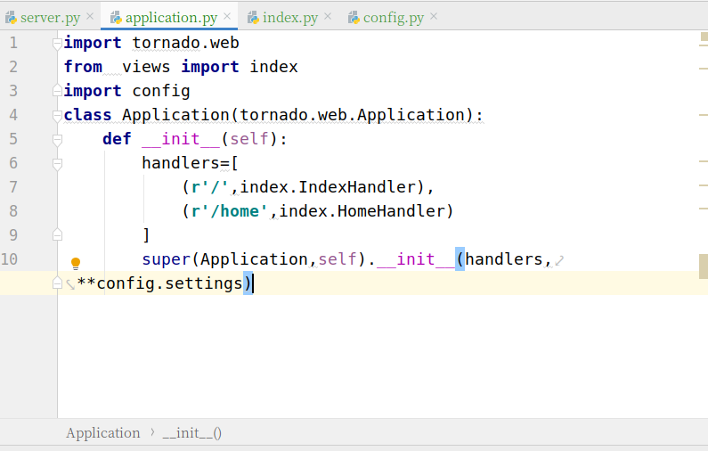
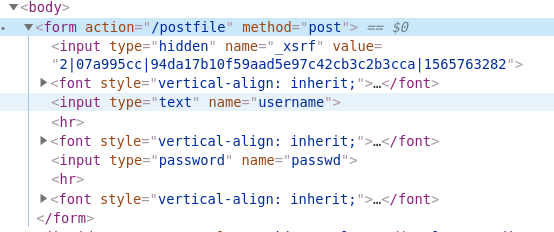

tornado

## 基础流程

### 第一个实例

```Python
#server01.py
#tornado 的基础web模块,
import tornado.web
#tornado的核心io循环模块,封装了linux的epoll，是tornado高效的基础
import tornado.ioloop
#类比Django中的视图
#一个业务处理类
class IndexHandler(tornado.web.RequestHandler):
    #处理get请求，不能处理POST请求
    def get(self,*args,**kwargs):
        #对应http1请求的方法
        #给浏览器响应信息
        self.write('sunck is a good man ')
if __name__=='__main__':
    #实例化一个app对象
    #application ：是tornado web框架的核心应用类,s是与服务器对应的接口
    #里面保存了路由映射表，有一个linsten方法，用了创建一个http服务器的实例并绑定了端口
    app=tornado.web.Application([
            (r'/',IndexHandler)
    ])
    #绑定监听端口
    #注意：此时服务器并没有开启监听
    app.listen(8000)
    '''
    IOLoop.current():返回当前线程的IOLoop实例
    IOLoop.start():启动IOlOOP实例的I/O循环，同时开启监听
    '''
    tornado.ioloop.IOLoop.current().start()
```

## 单进程与多进程

tornado默认启动单进程

- httpServer=tornado.httpserver.HTTPServer(app)
- httpServer.bind(port) 绑定端口
- httpServer.start(num) 启动num个进程，缺省默认为1，值为None,或者小于0，开启对应硬件机器的cpu核心数的进程
- app.listen() 只能在单进程模式中使用
- 多进程 虽然tornado 给我们提供了一次性启动多进程的方式，但是由于一些问题，不建议使用多进程实例的方式启动多进程，而是==手动启动多进程==，还能绑定多个端口
- 为什么不那样启动多进程：
  	1. 每个子进程都会从父进程中辅助一份IOloop的实例，如果在创建子进程前修改了IOloop，会影响所有的子进程
   2. 所有的进程都是由一个命令，无法做到在不停止服务的情况下修改代码
   3. 所有进程共享一个端口，想要分别监控很困难

### 多进程实例

```python
#server03.py
import tornado.web
import tornado.ioloop
import tornado.httpserver
class IndexHandler(tornado.web.RequestHandler):
    def get(self,*args,**kwargs):
        self.write('sunck is a good man ')
if __name__=='__main__':
    app=tornado.web.Application([
            (r'/',IndexHandler)
    ])
    #app.listen(8000) #这个就是默认监听8000借口并且开启服务器1个进程
    httpServer=tornado.httpserver.HTTPServer(app)
    #将服务器绑定到8000端口
    #httpServer.listen(8000)
    httpServer.bind(8000)
    #启动5个进程，缺省默认为1，值为None,或者小于0，开启对应硬件机器的cpu核心数的进程
    httpServer.start(5)
    tornado.ioloop.IOLoop.current().start()
```

## option模块

tornado为我们提供了一个tornado.options 模块
作用：全局参数的定义，存储，转换

#### 基础方法与属性：

  		1. **tornado.options.define()**
       功能：定义option选项变量的方法
       参数：
       
       - name 选项变量名，必须保证其唯一性，否则会报错"Option xxx alredy define in ..."
       - default 设置选项变量的默认值，默认为None
       - type 设置选项的类型,从命令行或者配置文件导入参数时，tornado会根据类型进行转换输入的值，转换不成会报错，可以是str,float，datetime，timedelta，如果没有设置type会根据default的值进行转换，如果没有设置default,就不会进行转换
       - multiple 设置选项变量是否可以为多个值，默认为False
       - help 选项变量的帮助提示信息
       - 实例：
       
       ```python
       #server04.py
       tornado.options.define('port',default=8000,type=int,help="this is a port",metavar=None,multiple=False,group=None,callback=None)
       #常用参数,设置变量为list ，传入列表，列表元素为字符串类型
       tornado.options.define('list',default=[],type=str)
       ```
  
         		2. **tornado.options.options**
功能：全局的options对象，所有定义的选项变量都会作为给对象的属性
       

- 实例： 

       ```python
       #server04.py 上面定义的变量 
       httpServer.bind(tornado.options.options.port)
       ```

#### 获取参数的方法

1. **tornado.options.parse_command_line()**

    作用：可以转换命令行参数，

    ```shell
    #server04.py
    import tornado.web
    import tornado.ioloop
    import tornado.httpserver
    import tornado.options
    from tornado.options import options
    #函数的原型
    #定义2个参数
    tornado.options.define('port',default=8000,type=int,help="this is a port",metavar=None,multiple=False,group=None,callback=None)
    #常用参数,设置变量为list ，传入列表，列表元素为字符串类型
    tornado.options.define('list',default=[],type=str,multiple=True)
    class IndexHandler(tornado.web.RequestHandler):
        def get(self,*args,**kwargs):
            self.write('sunck is a good man ')
    if __name__=='__main__':
        #转换命令行参数，并保存到tornado.options.options
        tornado.options.parse_command_line()
        print('list',tornado.options.options.list)
        app=tornado.web.Application([
                (r'/',IndexHandler)
        ])
        httpServer=tornado.httpserver.HTTPServer(app)
        #使用变量的值
        httpServer.bind(tornado.options.options.port)
        httpServer.start(1)
        tornado.ioloop.IOLoop.current().start()
    ```

    命令行启动实例

    ```shell
    (venv) tarena@tarena:~/桌面/tornado/code$ python3 server04.py --port=9000 --list=good,nice,handsome,cool
    ```

2. **tornado.options.parse_config_file(path)**
    功能：从配置文件导入参数
    创建一个名为config的普通文件

    ```python
    '''
    config文件
    port = 7000
    list = ['good','nice','handsome']
    '''
    if __name__=='__main__':
        #转换命令行参数，并保存到tornado.options.options
        tornado.options.parse_config_file('config')
        print('list',tornado.options.options.list)
    ```

    说明：书写格式仍要需要安装python的语法要。

## 导入参数

**最终版，创建config.py的普通文件,直接导入到主文件，不使用option模块**

```python
#config.py
#参数
options={
    'port':8080,
    'list':['good','nice','handsome']
}
```

```python
#sever06.py
import tornado.web
import tornado.ioloop
import tornado.httpserver
import config
class IndexHandler(tornado.web.RequestHandler):
    def get(self,*args,**kwargs):
        self.write('sunck is a good man ')
if __name__=='__main__':
    print('list',config.options['list'])
    app=tornado.web.Application([
            (r'/',IndexHandler)
    ])
    httpServer=tornado.httpserver.HTTPServer(app)
    httpServer.bind(config.options['port'])
    httpServer.start(1)
    tornado.ioloop.IOLoop.current().start()
```

## 日志

当我们在代码中使用parse_command_line()或者parse_config_file(path)方法时，tornado会默认开启logging模块功能，会向我们的终端输出一些打印信息
**关闭日志：**

1. 在主函数的第一行里加入代码

```python
#server05.py
if __name__=='__main__':
   #关闭日志
	tornado.options.options.logging=None
    #转换命令行参数，并保存到tornado.options.options
    tornado.options.parse_config_file('config')
    print('list',tornado.options.options.list)
```

2. 命令行输入

```python
if __name__=='__main__':
    #转换命令行参数，并保存到tornado.options.options
    tornado.options.parse_command_line()
'''
命令行输入(venv) tarena@tarena:~/桌面/tornado/code$ python3 server04.py --port=9000 --list=good,nice,handsome,cool --logging=none
'''
```

# 请求与响应

## tornado 工程模板



## application文件

作用：URL映射文件


### settings变量

**debug**

- 作用：设置tornado是否工作在调试模式下，默认为False即工作在生产模式下
- True特性：

  		1. 自动重启:
       - tornado应用会监控源代码文件，当有保存改动时就重新启动服务器，减少手动启动的次数，提高开发效率.
       - 如果保存后代码有错误，会导致重启失败，修改错误后，需要手动重启
       - 可以通过设置autoreload为True设置

2. 取消缓存编译的模板
    - 通过complied_template_cahe=False单独设置
3. 取消缓存静态文件的hash值
    - 清除css 缓存等静态文件后面的hash值
    - 可以通过static_hash_cahe=False单独设置
4. 提供追踪信息(不用太注意)
    - 可以通过serve_traceback=True设置

**static_path**

- 作用：设置静态文件目录

**template_path**

- 作用：设置模板文件的目录

**autoescape**

- 作用：当为None时关闭当前项目的自动转义，一般不建议使用

**cookie_secret**

- 作用：配置安全cookie秘钥

**xsrf_cookies**

- 作用：当为True开启XSRF保护

**login_url**

- 作用：用于tornado.web.authenticated装饰器，验证失败时，默认跳转的URL

### 路由

1. 普通路由

```Python
 (r'/',index.IndexHandler)
```

2. 带参数的路由（非客户端传输）
    **重写initialize方法接收传递的参数**

```Python
#application.py 路由参数
(r'/sunck',index.SunckHandler,{'word1':"good",'word2':'nice'})

#index.py ,视图函数重写
class SunckHandler(RequestHandler):
    #该方法会在HTTP方法(get,post)之前调用
    def initialize(self,word1,word2):
        self.word1=word1
        self.word2=word2
    def get(self,*args,**kwargs):
        # print(self.word1,self.word2)
        self.write('sunck is a nice man')
```

3. 反向解析,传参(非客户端传输)

    **同样重写initialize方法接收传递的参数**
    **url= self.reverse_url(name)反向解析获取真实URL**，

```python
#application.py,路由映射
tornado.web.url(r'/kaige',index.KaigeHandler,{'word3':"handsome",'word4':'cool'},name='kaige')

#index.py
#首页返回一个超链接，href使用反向解析名，
class IndexHandler(RequestHandler):
    def get(self,*args,**kwargs):
        #获取name为‘kaige’的路由的正则匹配
        url=self.reverse_url('kaige')
        self.write('<a href="%s">去另一个界面</a>'%url)
```

- 注意：如果使用name反向，不能使用原来的（）路由，需要使用tornado.web.url定义路由

### RequestHandeler(视图函数基类)

#### 1. 利用http协议向服务器传递参数（正则分组取值）

- **提取url的特定部分**

```Python
URL=http://127.0.0.1:8000/liuyifei/sunck/good/nice/
从中提取参数，sunck,good,nice
#application.py
(r'/liuyifei/(\w+)/(\w+)/(\w+)',index.LiuyifeiHandler)

#index.py handler类（视图）
class LiuyifeiHandler(RequestHandler):
    def get(self,h1,h2,h3,*args,**kwargs):
        print(h1,h2,h3,sep='-')
        self.write('liuyifei is a nice women')
```

​	正则分组命名为捕获组,handler类关键字传参

```Python
URL=http://127.0.0.1:8000/liuyifei/sunck/good/nice/
从中提取参数，sunck,good,nice
#application.py
(r'/liuyifei/(？P<p1>\w+)/(？P<p2>\w+)/(？P<p3>\w+)',index.LiuyifeiHandler),

#index.py handler类（视图）
class LiuyifeiHandler(RequestHandler):
    def get(self,p1,p2,p3,*args,**kwargs):
        print(p1,p2,p3,sep='-')
        self.write('liuyifei is a nice women')
```

#### 2. 查询字符串（get方式传递参数）

- **使用函数：name=self.get_query_argument(name,default=ARG_DEFAULT,strip=True)**
  **参数**：

1. **name** 从get请求参数字符串中返回指定参数的值
    - 如果出现多个同名参数，返回最后一个值
2. **default** 设置未传name参数的值，使用default的值
    - 如果default没有设置，那么就会抛出一个tornado.web.MissingArgumentError异常
3. **strip** 表示是否过滤掉两边空白字符，默认为True过滤

实例

```Python
#url:127.0.0.1:9000/?a=1&b=1&c=  1
#application.py
(r'/zhangmanyu',index.ZhangmanyuHandler)
 
#index.py
class ZhangmanyuHandler(RequestHandler):
    def get(self,*args,**kwargs):
        a=self.get_query_argument('a')
        b = self.get_query_argument('b')
        c = self.get_query_argument('c')
        print(a,b,'*'+c+'*')
        self.write('zhangmanyu is good women')
#结果： a b *c*
```

**取一个变量2个值的情况url（172.0.0.1:8000?a=1&a=2）**

- 使用函数：name_list=self.get_query_arguments(name,strip=True)
- 得到一个列表，没有默认值

#### 3. 请求体携带参数(post方式传递参数)

- **在http报文头中增加字段**

- **使用函数：name=self.get_body_argument(name,default=ARG_DEFAULT,strip=True)参数同上**
- **多选(复选框)使用：name_list=self.get_body_arguments(name,strip=True)**
  实例

```html
//postfile.html
<form action="/postfile" method="post">
        姓名：<input type="text" name="username"/>
        <hr/>
        密码：<input type="password" name="passwd"/>
        <hr/>
        爱好：
        <input type="checkbox" value="power" name="hobby">权利
        <input type="checkbox" value="money" name="hobby">金钱
        <input type="checkbox" value="book" name="hobby">书
        <input type="submit" value="登录"/>
    </form>
```

```python
#application.py
(r'/postfile',index.PostFileHandler)

#index.py
class PostFileHandler(RequestHandler):
    def get(self,*args,**kwargs):
        self.render('postfile.html')
    def post(self,*args,**kwargs):
        name=self.get_body_argument('username')
        passwd=self.get_body_argument('passwd')
        hobbyList=self.get_body_arguments('hobby') #取复选框多个
        print(name,passwd,hobbyList)
        self.write('sunck is a handsome man')
#结果：dahaigu jibuzhu555 ['power', 'money']
```

#### 4. 即可以获取get请求，也可以获取post请求

- **使用函数:name=self.get_argument(name,default=ARG_DEFAULT,strip=True)**
- **多选使用:name_list=self.get_arguments(name,strip=True)**

```python
#project04.index.py
#如果变量不存在就赋值默认值’/‘
next=self.get_argument('next','/')
```


- **注意：一般不会这么使用，无法区分请求方式**

### request对象

**属性参数**：

1. method	http请求的方式
2. host	被请求的主机
3. uri   请求的完整资料地址，包括路径和get查询参数部分
4. path    请求的路径部分
5. query   请求参数部分
6. version   使用的htttp版本
7. headers   请求的协议头，是一个字典类型
8. body    请求体数据，post请求才有
9. remote_ip   客户端的ip
10. files    用户上传的文件，字典类型

- 实例

```Python
#url:	http://127.0.0.1:9000/zhuyin?a=1&b=2
class ZhuyingHandler(RequestHandler):
    def get(self,*args,**kwargs):
        print('method',self.request.method)
        print('host',self.request.host)
        print('url',self.request.uri)
        print('path',self.request.path)
        print('query',self.request.query)
        print('version',self.request.version)
        print('headers',self.request.headers)
        print('body',self.request.body)
        print('remote_ip',self.request.remote_ip)
        print('files',self.request.files)
        self.write('zhuyin is a good women')
```

- 输出结果

```txt
method GET
host 127.0.0.1:9000
url /zhuyin?a=1&b=2
path /zhuyin
query a=1&b=2
version HTTP/1.1
headers Host: 127.0.0.1:9000
Connection: keep-alive
Upgrade-Insecure-Requests: 1
User-Agent: Mozilla/5.0 (X11; Linux x86_64) AppleWebKit/537.36 (KHTML, like Gecko) Chrome/75.0.3770.100 Safari/537.36
Accept: text/html,application/xhtml+xml,application/xml;q=0.9,image/webp,image/apng,*/*;q=0.8,application/signed-exchange;v=b3
Accept-Encoding: gzip, deflate, br
Accept-Language: zh-CN,zh;q=0.9

body b''	#没有post请求
remote_ip 127.0.0.1
files {}	#没有文件上传，具体看下面
================================================================================
files一般格式：{name1:[tornado.httputil.HTTPfile对象,tornado.httputil.HTTPfile对象],name2:[ tornado.httputil.HTTPfile对象,..]}
####name为前端input表情的name属性名
```

### tornado.httputil.HTTPfile对象(文件上传)

- **作用：是接受到的文件对象**
- **属性：**

1. filename  上传文件的实际名，用于创建本地文件名
2. body  文件的数据实体,将body属性写入文件中保存到本地
3. content_type   文件类型,多用于判断上传文件类型是否正确

- **实例**

```html
//前端输入 upfile.html
<form method="post" action="/upfile" enctype="multipart/form-data">
        <input type="file" name="file">
        <input type="file" name="file">
        <input type="file" name='img'>
        <input type="submit" value="上传">
    </form>
```

```python
#application.py	
(r'/upfile',index.UpFileHandler)
```

```python
#index.py
class UpFileHandler(RequestHandler):
    def get(self,*args,**kwargs):
        self.render('upfile.html')
    def post(self,*args,**kwargs):
        filesDict=self.request.files
		print(filesDict)	#打印request.files属性
'''
{	#键值file为input的name值，
	'file': [ 
		{	#字典value值为一个列表，里面是每个文件的 tornado.httputil.HTTPfile对象
			#每个对象都是有3个属性，'filename','body','content_type'
			'filename': '1.txt', 			
			'body': b'hhahhaa\n', 
			'content_type': 'text/plain'
		}, {
			'filename': '1 2.txt', 'body': b'', 
			'content_type': 'text/plain'
		}	], 
	'img': [
		{
			'filename': '1 3.png', 
			'body': b'', 
			'content_type': 'image/png'
		}
	]
}
'''        #遍历request.file键值
        for inputname in filesDict:
        	#取出相应的文件（tornado.httputil.HTTPfile对象）列表
            fileArr=filesDict[inputname]
            #遍历（tornado.httputil.HTTPfile对象）列表
            for fileObject in fileArr:
                import os
                import config
                #创建存储路径,可以通过'对象名.属性'的方式取出属性值
             filePath=os.path.join(config.BASE_DIRS,'upfile/'+fileObject.filename)
                #存储到本地
                with open(filePath,'wb') as f:
                    #通过存储body里的数据来把数据存储到本地文件
                    f.write(fileObject.body)
        self.write('ok')
```

## 响应

### write

- **原型：self.write(chunk)**
- **作用：将chunk数据写到输出缓冲区**

**cookie：多次连续发送self.write(data)，先存放在客户端缓存中，服务器响应结束，客户端是一次接受全部**

- **self.finish()**
  1. 刷新缓存区，关闭当次请求通道
  2. 在finish()下面不要再写write，报错：RuntimeError: Cannot write() after finish()

```python
#write
class WriteHandler(RequestHandler):
    def get(self,*args,**kwargs):
        self.write('good')
        self.write('nice')
        self.write('handsome')
        self.write('man')
        self.finish()
        #下面写了报错
        self.write('right')
```

- 浏览器打印结果

```
goodnicehandsomeman
//全部记在一起，self.finish()下面的没有打印，其实服务器已经报错
```

#### 利用write方式写json数据

- 正常写法json

```Python
#application.py
class Json1Handler(RequestHandler):
    def get(self,*args,**kwargs):
        per={
            'name':'sunck',
            'age':18,
            'height':175,
            'weight':70
        }
        import json
        jsonStr=json.dumps(per)
        self.write(jsonStr)
```

- write直接发送json数据

```Python
#application.py
class Json2Handler(RequestHandler):
    def get(self,*args,**kwargs):
        per={
            'name':'sunck',
            'age':18,
            'height':175,
            'weight':70
        }
        self.write(per)
```

- 注意：自己手动序列化json方式Content-Type属性值为text/html.而采用write自动序列化方式，Content-Type属性值为application/json，**推荐使用第二种方法**

### set_header(name,value)

- 作用：手动设置一个名为name，值为value的响应头字段
- 参数：
  1. name:字段名称
  2. value:字段值
- 可以修改一些原来的响应头数据（抓包看不到？？），也可以自定义新的

- 实例

```python
#application.py 用上面write第一个例子
class Json1Handler(RequestHandler):
    def get(self,*args,**kwargs):
        per={
           'name':'sunck','age':18,'height':175,'weight':70
        }
        import json
        jsonStr=json.dumps(per)
        #修改原有属性
        self.set_header('Content-Type','application/json;charset=utf-8')
        #自定义响应头属性
        self.set_header('sunck','hhgood')
        self.write(jsonStr)
```

### set_default_headers()

- 作用：在进入http响应处理（get,post...）方法之前被调用,可以重写改方法来预先设置默认的headers
- 注意：在Http处理方法中使用set_header设置的字段会覆盖set_default_headers()里面的默认字段的值
- 实例

```Python
#application.py
class HeaderHandler(RequestHandler):
    #重写，里面设置在默认响应头适用于整个类，每个http处理方法
    def set_default_headers(self):
        #同样在里面使用self.set_header()方法设置
        self.set_header('Content-Type','text/html;charset=utf-8')
         self.set_header('kaige','nice')
    def get(self,*args,**kwargs):
        #因为http处理方法是后执行，所以这里的设置会覆盖上面的
        self.set_header('kaige','handsome')
        self.write('good nice')
    def post(self,*args,**kwargs):
        pass
```

### self.set_status(status_code,reason=None)

- 作用：为响应设置状态码,可以自定义状态码,或者修改原有状态码的描述
- 参数：
  1. status_code:状态码值：为intl类型，
     - 如果reason的值为None，则状态码必须为正常值(非自定义)，正常值自带reason值，比如404，not found,，不然就报错
  2. reason:描述状态码的词组，string类型

- 实例

```Python
#application.py 	状态码
class StatusCodeHandler(RequestHandler):
    def get(self,*args,**kwargs):
        self.set_status(200,'我是谁，我在哪里')
        self.write('88888888888888888888888888')
```

### 重定向 self.redirect(url)

- 作用：重定向到url
- 实例

```python
#application.py 	重定向
class RedirectHandler(RequestHandler):
    def get(self,*args,**kwargs):
        self.redirect('/')
```

### 响应错误

#### self.send_error(status_code=500,**kwargs)

- 作用：抛出http错误状态码，默认为500，抛出错误后tornado会调用write_error()方法进行处理，并返回给浏览器错误界面,
- 对应django 404 界面，这个方法就是定义错误也没
- 注意：在send_error之后就不要有响应输出了(self.write())
- 实例在下面

#### wirte_error(status_code,**kwargs)

- 作用：用来处理send_error抛出的错误信息（状态码），根据错误状态码，返回相对的响应给浏览器错误界面

```python
#application.py		错误处理
class ErrorHandler(RequestHandler):
    #根据错误
    def write_error(self, status_code, **kwargs):
        if status_code==500:
            code=500
            #返回500界面（自定义）
            self.write('服务器内部错误')
        elif status_code==404:
            code=404
            #返回404界面(自定义)
            self.write('资料不存在')
        self.set_header(status_code)#定义状态码，告知浏览器发生错误
    def get(self,*args,**kwargs):
        #通过flag码来调试错误页面
        flag=self.get_query_argument('flag')
        if flag== '0':
            #执行self.send_error()就跳到self.write_error方法
            self.send_error(500)#50
            0这个参数是自己定义的
            self.write('error')#这段代码永远无法执行
        self.write('you are right')
```

## 接口调用顺序

### 方法

- **initialize()**
    **作用**：获取路由中{}传递的参数，并设置成对象属性

- **prepare()**
    **作用**：预处理方法，在执行对应的（http）请求方法之前调用（类似中间件）
    **注意**：任何一种http请求都会执行prepare方法

- **http方法**

    1. get
        优点：速度快效率高，不安全，数据量小
    2. post
        - 特点：将请求的数据单独打包
        - 优点：所能承载的数据量大，安全
        - 缺点：效率低，速度满
        - 适用场景：涉及到修改服务器上的数据，一般用post，其他使用get
    3. head
        定义：类似get请求，不过响应中没有具体内容，用户获取报头的

    4. delete
        定义：请求服务器删除指定的资源
    5. put
        定义：从客户端向服务器传送指定的内容
    6. patch
        定义：修改局部内容
    7. options
        定义：返回url支持的所有http方法

- **set_default_headers()**

- **write_error()**
    上面有

- **on_finish()**
    **作用：**在请求处理结束后调用，在该方法中进行一个资源的清理释放，或者日志处理
    **注意：**尽量不要在该方法中进行响应输出

### 顺序

实例代码

```Python
#project03 index.py
class IndexHandler(RequestHandler):
    def get(self,*args,**kwargs):
        print('http方法')
        #报错调试时打开
        #self.send_error(500) 
        self.write('good man')
    def prepare(self,*args,**kwargs):
        print('prepare')
    	self.write('very very man')
    def initialize(self,*args,**kwargs):
        print('initialize')
    def set_default_headers(self,*args,**kwargs):
        print('set_defualt_headers')
    def on_finish(self,*args,**kwargs) -> None:
        print('on_finish')
    def write_error(self, status_code,*args, **kwargs):
        print('write error')
        self.write('服务器内部错误')
```

- 在正常情况未抛出错误时

```python
set_defualt_headers
initialize
prepare
http方法
on_finish

浏览器页面:#very very mangood man            
prepare和http方法中的write方法都执行了
```

- 在抛出错误时

```Python
set_defualt_headers
initialize
prepare
http方法
set_defualt_headers#发生错误，重新执行设置默认响应头
write error
on_finish

浏览器页面：#服务器内部错误
```

**注意：**如果在prepare中设置self.send_error()方法，则http方法就不会执行了 

# 模板

### **配置模板路径**

```python
#config.py
#配置,'template_path'就是模板路径
settings={
    'template_path':os.path.join(BASE_DIRS,'templates'),
}
```

### **渲染并返回给客户端**

- 使用**self.render(html)**方法

```python
#project03 index.py
class HomeHandler(RequestHandler):
    def get(self,*args,**kwargs):
        self.render('home.html')
```

### **传输变量与表达式**

- **前端语法：**
    1. 变量{{var}}
    2. 表达式{{expression}}
    3. 字典对象{{dict["key"]}}

- **后端方法表达式：**
    - **self.render(html,name1=value1,name2=value2,.....)**

```Python
#project03 index.py
class HomeHandler(RequestHandler):
    def get(self,*args,**kwargs):
        temp=100
        dict={'name':'tom','age':18}
        self.render('home.html',num=temp,per=dict)
```

- 模板html文件

```html
//templates.home.html
	<h1>这里是home页面</h1>
    <h1>num:{{ num }}</h1>
    <h1>num+10:{{ num + 10}}</h1>	//做加法运算
    <h1>num:{{ num }}</h1>
	<h1>name:{{ per['name']}}</h1>
```

- 浏览器显示结果

```
这里是home页面
num:100
num+10:110
num:100
name:tom
```

### 前端模板流程控制

- **if**

```html

	语句1

	语句2

	语句3

```

- **for**

```

	循环语句

```

- **while用的少**

### 模板函数

#### static_url()

- **作用**：静态文件路径拼接,实际路径和settings中‘static_path’有关，就是在修改settings中‘static_path’值的情况下，不需要修改模板的静态文件链接路径
- **格式**：**href="{{static_url('css/home.css')}}"**
- **优点：**
    1. 修改目录不需要修改url
    2. static_url创建了一个基于文件内容的hash值，并将其添加到URL末尾（当一个查询参数），这个hash值总能保证加载的都是最新文件,而不是以前的缓存版本，每次加载都是服务器新传入的，这个特性无论特性无论是开发阶段还是上线阶段都是很有用的(**重要**)

#### 自定义函数

- 定义：在后端定义一个函数，然后将函数名传到前端，前端直接使用”函数名(参数)“调用
- 格式：**{{  fun(name1,name2)  }}**
- 实例

```python
#project03.index.py		自定义函数
class FunctionHandler(RequestHandler):
    def get(self,*args,**kwargs):
        def mySum(n1,n2):
            return n1+n2
        self.render('home.html',mySum=mySum) 
```

- 前端页面

```html
 <h1>{{ mySum(100,89) }}</h1>
```

- 浏览器显示结果

```
189
```

### 转义

- 定义：tornado默认是开启自动转义功能，能**防止网站受到恶意攻击**，不会渲染传递的后端字符串
- 关闭自动转义
    1. raw  
        - 格式：
        - 只能关闭一行
    2.  autoescape None
        - 格式：
        - 关闭当前html文档的自动转义，不管这句话的位置在哪
    3. 在配置中修改（一般很少使用）
        - 格式：config.py	==>	settings  =  {  'autoescape':None  }
        - 关闭整个服务器的自动转义
    4. escape()函数
        - 作用：在关闭自动转义后可以使用该方法对特定的变量进行转义

- 实例

```python
class TransHandler(RequestHandler):
    def get(self,*args,**kwargs):
        str='<h1>sunck is a good man </h1>'
        self.render('trans.html',str=str) 	
```

前端模板代码

```html
//情况一
{{ str }}

==============================
//情况二

{{ str }}
{{ escape(str)}}
{{ str }}
```

结果显示

```
#情况一页面
<h1>sunck is a good man </h1>
sunck is a good man
===================================
#情况二页面
sunck is a good man
<h1>sunck is a good man </h1>
sunck is a good man
```

### 继承

和django差不多

- 父模板

```
//project03.templates.base.html



```

- 子模板

```
//project03.templates.cart.html


<h1>这里是购物车页面</h1>

```

### 取静态文件

1. **static_path**
    - 作用：告诉tornado从文件系统中的某个特定的位置提供静态文件（静态首页）
    - 引入文件：**href="{{  static_url('css/home.css')  }}"**
    - 请求方式：取project03.static.html.index.html文件，浏览器输入：http://127.0.0.1:8000/static/html/index.html
    - 实例

```python
#config.py
settings={
    'static_path':os.path.join(BASE_DIRS,'static')
    }
```

2. **StaticFileHandler**
    - 使用原因：因为“http://127.0.0.1:8000/static/html/index.html“对于用户来说体验不佳
    - 本质：是tornado预制的用来提供静态资源文件的handler
    - 作用：可以通过**tornado.web.StaticFileHandler** 来映射静态文件
    - 使用：**tornado.web.StaticFileHandler(path,default_filename)**方法，只要在URL那里写好就行，不用重写
        - 参数：
            - path:用来指定静态文件的根路径，url传递过来的文件名与路径下的文件名匹配，比如index.html
            - default_filename:用来指定访问路由中未指明文件名时，默认提供的静态文件
    - 注意：写在最后在路由配置的最后面，不然就会是其他路由无法匹配，用（r'/(.*)$'）同时替换原来（r'/'）主页路由，前提是要有首页静态文件
    - 实例：

```Python
#application.py
#StaticFielHandler要放在所有路由的最下面

(r'/(.*)$',tornado.web.StaticFileHandler,{"path":os.path.join(config.BASE_DIRS,'static/html'),'default_filename':'index.html'})
```

- 实现效果

```python
取project03.static.html.index.html
传统方式
浏览器输入：http://127.0.0.1:8000/static/html/index.htm

改进方式一
URL:(r'/(.*)$',tornado.web.StaticFileHandler{"path":os.path.join(config.BASE_DIRS,'static/html')})
浏览器输入：http://127.0.0.1:8080/index.html

改进方式二
URL：
 (r'/(.*)$',tornado.web.StaticFileHandler,{"path":os.path.join(config.BASE_DIRS,'static/html'),'default_filename':'index.html'})
浏览器输入：http://127.0.0.1:8080/index.html
       	http://127.0.0.1:8080

```

# 数据库

- 概述：tronado没有自带的ORM,对于数据库需要自己来适配
- 目前python3.6+ tornado还没有完善的驱动
- **链接:**在应用启动时，创建一个数据库链接实例，提供各个requesthandler使用
- **在requesthandler中通过self.application来获取其应用对象**
- 实例

```python
#project03.config.py
# 数据库配置
mysql = {
    'host': 'localhost',
    'user': 'root',
    'passwd': '123456',
    'dbName': 'tornado'
}
#project03.application.py
#使用已经封装好的模块sunckMysql
from ORM.sunckMysql import SunckMySQL
class Application(tornado.web.Application):
    def __init__(self):
        handlers = [   
        ]
        #建立数据库链接对象
        self.db= SunckMySQL(**config.mysql)
```

- handler类调用数据库操作

```python
# 数据库
class StudentHandler(RequestHandler):
    def get(self, *args, **kwargs):
        # 去数据库提取数据
        self.application.db.insert('insert into students (name,age) values("dahaigui",30)')
        stus = self.application.db.get_all_obj('select * from students','students')
 		stus_two = self.application.db.get_all_obj('select name,age from students','students','name','age')
        print(stus)
        self.write('ok')
        # self.render('students.html', stus=stus)
```

# 应用安全

### cookie

#### **普通cookie**

- **设置(生成)cookie**
    - 函数原型：**self.set_cookie(name,value,domain=None,expires=None,path='/',expires_days=None,××kwargs)**
    - 参数：
        1. **name**：cookie名
        2. **value**：cookie值，必须为字符串或者字节串类型
        3. **domain**：提交cookie时匹配的域名
        4. **path**：提交cookie时的路径
        5. **expires**：cookie的有效期,可以是时间戳整数，时间元祖，datetime类型，为utc时间,默认为None，会话结束就清除
        6. **expires_days**：cookie的有效期天数。优先级低于expires。

- 实例

```Python
#project04.views.index.py
class PCookieHandler(RequestHandler):
    def get(self,*args,**kwargs):
        #设置
        self.set_cookie('sunck','good')
        self.write('ok')
```

- **实际原理：设置cookie实际上是通过设置header的Set-Cookie来实现的**

- 实例: **实现效果和上面的实例一样**

```Python
#project04.views.index.py
class PCookieHandler(RequestHandler):
    def get(self,*args,**kwargs):
        #设置
		self.set_header('Set-Cookie','sunck=good1; Path=/')
        self.write('ok')
```

- **获取cookie:**

    - 函数原型：
        **self.get_cookie(name,default=None)**
    - 参数：
        1. **name：**要获取的cookie的名称
        2. **default：**如果名为name的cookie不存在，则返回default的值
        3. **返回值：**字符串类型

- 实例

    ```python
    #project04.views.index.py
    class GetPCookieHandler(RequestHandler):
        def get(self,*args,**kwargs):
            #获取一个cookie
            cookie=self.get_cookie('sunck','未登录')
            self.write('ok')
    ```

**清除cookie**

1. 函数原型：清除一个cookie
    **self.clear_cookie(name,path='/',domain=None)**
    - 作用：删除名为name,并同时匹配domain和path的cookie

- 实例

```Python
#project04.views.index.py
class ClearPCookieHandler(RequestHandler):
    def get(self,*args,**kwargs):
        #清除cookie
        self.clear_cookie('sunck')
        self.write('ok')
```

2. 函数原型：清除所有
    **self.clear_all_cookies(path='/',domain=None)**
    - 作用：删除同时匹配path和domain的所有cookie

- 实例

```Python
#project04.views.index.py
class ClearPCookieHandler(RequestHandler):
    def get(self,*args,**kwargs):
        #清除所有相关cookie
		self.clear_all_cookies(path='/',domain=None)
        self.write('ok')
```

- **注意：**执行删除cookie操作后，并不是立即删除浏览端的cookie,而是给cookie值设置为空，并改变其有效期限为失效，真正删除cookie是由浏览器自己去清理的

#### 安全cookie

- 概述：
    - cookie是存储在客户端浏览器的数据，很容易被篡改
    - tornado提供了一种对cookie进行简易的加密方式来防止cookie被恶意篡改

- **设置生成**：
    - 需要一个应用配置（settings）用来给cookie进行混淆加密的秘钥
    - 生成一个秘钥：写到config.settiings中,键为"cookie_secret"
    - 原型函数：**self.set_secure_cookie(name,value,expires_days=30,version=None,××kwargs)**
        - 作用：设置一个带有时间戳的cookie，防止cookie被伪造
        - 参数：
            - name：cookie名
            - value：cookie值
            - expires_days：有效天数，默认30
            - version：版本号，看下面

- 实例:先生成一个秘钥，放到settings中去

```Python
#加密生产秘钥
import base64
import uuid
s=base64.b64encode(uuid.uuid4().bytes+uuid.uuid4().bytes)
b'qzEK3FRNRDuUtz0NoL1FMH7Rr8A1KkTIv81BkdsCkvI='

#写到配置文件给整个项目使用
#config.py
#sttings={
	  'cookie_secret':'qzEK3FRNRDuUtz0NoL1FMH7Rr8A1KkTIv81BkdsCkvI='
}
```

```python
#project04.views.index.py
#安全cookie
class SCookieHandler(RequestHandler):
    def get(self,*args,**kwargs):
        self.set_secure_cookie('zhangmanyu','nice')
        self.write('ok')
```

- 客户端浏览器里观察到的cookie值分析

    - cookie值："2|1:0|10:1565694969|10:zhangmanyu|8:bmljZQ==|cbba7e2b79c8ff2ba8c36436577441e14f7ff2794023d0c8defd2a9f8fac6836"
    - 说明：以”|“分开参数，带”：“的前面数为长度，后面为内容
        - ”2“安全cookie的版本，默认为版本为2
        - ”1:0“默认为0
        - 时间戳
        - cookie名
        - base64编码的cookie值
        - 签名值，不带长度说明

    - 注意：普通cookie，后端发什么，前端显示什么

- **获取cookie：**
    - 函数原型**self.get_secure_cookie(name,value=None,max_age_days=31,min_version=None)**
        - 参数：
            - name：cookie名
            - value ：没有响应cookie名存在是的默认值，默认为None
            - max_age_days：不同于expires_days,expires_days是设置浏览器中cookie得到有效时间，而max_age_days1是过滤安全cookie的时间戳,有效超过这个天数的不要
            - 返回值：byte类型
    - 如果cookie存在且存在且验证通过，返回cookie值，否则返回None
- 实例

```Python
#project04.views.index.py
class GetSCookieHandler(RequestHandler):
    def get(self,*args,**kwargs):
        scookie=self.get_secure_cookie('zhangmanyu')
        print(scookie)
        self.write('ok')
#打印结果：b'nice'		字节串类型
```


- **注意：**不是完全安全的，只是一定程度上增加了破解cookie的难度，以后cookie不要存储一些敏感性数据
- **使用场景：安全cookie用于存储token，普通cookie用于存储用户名，和状态保持**,

### XSRF（跨站请求伪造）

- 请求伪造实例
    - cookie计数器，记录网站被发起请求的次数

```Python
#project04.application.py
#cookie计数,记录浏览器访问次数
(r'/cookienum',index.CookieNumHandler),
```

```python
#project04.index.py
#cookie计数
class CookieNumHandler(RequestHandler):
    def get(self,*args,**kwargs):
        count=self.get_cookie('count',None)
        if not count:
            count=1
        else:
            count=int(count)
            count+=1
        self.set_cookie('count',str(count)) #cookie值必须为字符串或者字节串
        self.render('cookienum.html',count=count)
```

网页显示

```
第8次访问
```

使用外部网站向相同网址发送请求：<http://127.0.0.1:8080/cookienum>

```HTML
//test_cookie_count.html
url:file:///home/tarena/%E6%A1%8C%E9%9D%A2/tornado/project04/templates/test_cookie_count.html
<body>

<h1>伪装</h1>
</body>
```

上面网站打开2次就会向：http://127.0.0.1:8080/cookienum。发送2次请求，改变了后台的cookie值了，这就是跨站请求伪造，实际已经对服务器构成了危险。

网页显示：count值已经改变

```
第10次访问
```

- **结论：**

    - 当访问’‘test_cookie_count.html’‘外面的网站时，在我们不知情，未授权的情况下，"cookie计数器"网站cookie被使用，以至于'cookie计数器'网址认为是它自己调用Handler，改变了count值。
    - **启示：**上一个程序‘test_cookie_count.html’使用了get方式模拟了攻击，为了防止这种攻击，一般对于相对安全的操作一般不放在get请求中，常常使用的是POST请求

- **XSRF保护**

    - 同源策略：只有（同协议，同ip，同协议）同源的网站才能发请求

- **开启xsrf保护**

    - post请求伪造

        ```python
        #project04.application.py
        (r'/postfile,index.PostFileHandler),
         
        ##project04.index.py
        #新建POST请求改变cookie的count值
        class PostFileHandler(RequestHandler):
            def get(self,*args,**kwargs):
                self.render('postfile.html')
            def post(self,*args,**kwargs):
                count = self.get_cookie('count', None)
                if not count:
                    count=1
                else:
                    count=int(count)
                    count+=1
                self.set_cookie('count',str(count))
                self.redirect('/cookienum')
        ```

        - 新建本地网页，伪造POST请求

        ```html
        <form action="http://127.0.0.1:8080/postfile" method="post">
                姓名：<input type="text" name="username"/>
                <hr/>
                密码：<input type="password" name="passwd"/>
                <hr/>
                <input type="submit" value="登录"/>
        </form>
        ```

        - 结果页面,还是可以修改cookie的count值

        - 所以要开启xsrf保护

        ```python
        #project04.config.py
        settings={
        'xsrf_cookies':True
        }
        ```

        - 模板中应用：**模板页面表单里添加**

        ```html
        #postfile.html
          <form action="/postfile" method="post">
        		
                姓名：<input type="text" name="username"/>
                <hr/>
                密码：<input type="password" name="passwd"/>
                <hr/>
                <input type="submit" value="登录"/>
            </form>
        ```

        - 本质：为浏览器设置了_xsrf安全cookie,这个cookie在关闭浏览器后会失效
        - 为模板表单添加了一个隐藏域，名为__xsrf_,值为_xsrf这个cookie的_值

        

        - **可是**如果把上面name为__xsrf的input标签的内容全部复制到本地文件（用于跨站请求伪造的页面），还是可以，**所以这种方法也不是完全安全的。**
        - 攻击页面代码：

        ```HTML
        //手动添加
        <form action="http://127.0.0.1:8080/postfile" method="post">
        		<input type="hidden" name="_xsrf" 				 value="2|07a995cc|94da17b10f59aad5e97c42cb3c2b3cca|1565763282"/>
                姓名：<input type="text" name="username"/>
                <hr/>
                密码：<input type="password" name="passwd"/>
                <hr/>
                <input type="submit" value="登录"/>
        </form>
        ```

    - 非模板中使用

        - 手动设置_xsrf的cookie_，先在后端生成一个安全cookie发送到前端
        - ​    **self.xsrf_token**

        ```python
        #project04.index.py
        class SetXSRFCookieHandler(RequestHandler):
            def get(self,*args,**kwargs):
               	self.xsrf_token
                self.finish('ok')
        ```

        - 第一种：手动创建的input，并设置name属性值为_xsrf，value属性值为名为__xsrf的cookie的值,通过js获取浏览器里的__xsrf的cookie值，然后设置为input的value属性
        - 模板文件

        ```HTML
        //template.postfile.html 
        <input id="hi" type="hidden" name="_xsrf" value="">
            </form>
            <script>
                function getCookie(name) {
                    //正则获取cookie值
                    var cook=document.cookie.match('\\b'+name+'=([^:]*)\\b')
                    return cook ?cook[1]:undefined
                }
                document.getElementById('hi').value=getCookie('_xsrf')
            </script>
        ```

        - 第二种：在ajax请求中携带__xsrf的cookie值_

        ```javascript
        /postfile.html
        function login() {    
        
         					/发送数据中增加 _xsrf=cooike值  $.post('/postfile','_xsrf='+getCookie('_xsrf')+"&username="+'hh'+'&passwd=123456',function (data) {
                            alert('ok')
                        })
        }
        ```

        - 第三种：还是ajax请求，这次是设置请求头

        ```javascript
        /postfile.html
          function login() {
        		data={
                   'username':'sunck',
                   'passwd':'123456'
                }
         			var datastr=JSON.stringify(data1);
                        $.ajax({
                            url:'/postfile',
                            method:'POST',
                            data:data1,
                            success:function (data) {
                                alert('ok')
                            },
                            headers:{
                                'X-XSRFToken':getCookie('_xsrf')
                            }
                        })
                }
        ```

        - 问题是都是需要手动添加_xsrf的cookie
        - 解决方式：在用户登录首页时就自动设置上（发送）_xsrf的cookie
        - 重写静态文件HTML的URL

        ```python
        #project04.application.py
        #使用自定义handler类导入首页静态页面
        (r'/(.*)',index.StaticFileHandler,{'path':os.path.join(config.BASE_DIRS,'static/html'),'default_filename':'index.html'})
        ```

        - StaticFileHander类继承tornado.web.StaticFileHandler

        ```python
        #project01.index.py
        class StaticFileHandler(tornado.web.StaticFileHandler):
            def __init__(self,*args,**kwargs):
                super(StaticFileHandler,self).__init__(*args,**kwargs)
                self.xsrf_token
        ```

        

### 用户验证

- 概念：在用户的请求后进行预先判断用户的认证状态（是否登录），若验证通过则正常处理，不然就进入登录界面

- **tornado.web.authenticated装饰器**

    - Tornado将确保这个装饰器修饰的函数，只有合法的用户才能调用 

- 定义对象函数：**get_current_user(self)**

    - return ：   True  or   False
    - 验证用户的逻辑应该写在该方法中，若该方法返回为True说明验证成功，否则失败
    - 验证失败，请求会将访客重定向到配置中（settings）的login_url所指定的路由

- URL分析：在验证失败之后就会到login_url?next=需要验证权限的url

    ```html
    路由实例：http://127.0.0.1:8080/login?next=/home
    ```

    - **/login**：为settings中的login_url
    - **/home：**为上一个页面，在进入/home下的页面时验证失败才跳到这个页面

- 结论：可以把next值拿出来，在登录成功时，可以重定向到该页面，或者失败了还能保留这个URL，使再次进行登录验证，并且成功后还可以重定向到该页面。

- 如何改变**get_current_user(self)**的返回值，可以在重新想到该页面时get方式传递一个参数，**get_current_user(self)**函数中通过判断约定好的参数值，进行判断是否成功登录

- config.py  settings设置

```python
settings = {
    'login_url':'/login'
}
```

- 登录handler类实例

```Python
class LoginHandler(RequestHandler):
    def get(self,*args,**kwargs):
        #进入/home页面失败时进入登录界面
        #url：http://127.0.0.1:8080/login?next=/home
        #获取/home值传递给表单中的action路由为/login?next=/homes，是post方法中可以获取到/home值
        next=self.get_argument('next','/')
        self.render('login.html',url=next)
    def post(self,*args,**kwargs):
        name=self.get_body_argument('username')
        pawd=self.get_body_argument('passwd')
        if name=='1' and pawd=='1':
            #获取表提交中的next值，为/home
            next=self.get_argument('next','/')
            #重定向到/home,并在路由后面增加参数flag表示登录成功
            self.redirect(next+'?flag=logined')
        else:
            next = self.get_argument('next', '/')
            #登录失败就保留/login?next=/home，路由让用户下次登录成功后正确跳转到/home下
            self.redirect('/login?next='+next)
```

- 登录页面的HTML表单属性

```html
<!-project04.templates.login.html--!>
//POST请求URL为/login?next=/home
<form action="/login?next={{ url }}" method="post">
```

- 需要登录验证的/home的handler类

```python
#project04.index.py
class HomeHandler(RequestHandler):
    #在被装饰器装饰的函数之前被调用，返回True或者False
    def get_current_user(self):
        #判断URL中flag的值，默认为None，返回就是False
        #如果登录成功flag=logined,函数返回True
        flag=self.get_argument('flag',None)
        return flag
    #装饰器，根据上面函数的返回值决定是否进行下面的函数，失败就进入默认的URL下
    @tornado.web.authenticated
    def get(self,*args,**kwargs):
        self.render('home.html')
```


# 同步与异步

### 同步

概念：按部就班依次执行

实例：后面的程序必须等待前面的程序先完成

### 异步

概念：对于耗时的操作，会交给别人（另一个线程）去处理，我们继续向下执行，当别人结束耗时操作后在将结果反馈给我们

- 回调函数实现异步：同步与异步.async01.py

    ```Python
    #同步与异步.async01.py
    import time
    import threading
    
    # handler,耗时操作数据库查询等操作
    def longIo(callback):
        def run(cb):
            print('开始耗时操作')
            time.sleep(5)
            print('结束耗时操作')
            cb('sunck is good man')
        #创建一个线程进行异步操作
        threading.Thread(target=run,args=(callback,)).start()
    
    #回调函数，异步操作，类似ajax的success：函数
    def finish(data):
        print('开始处理回调函数')
        print('接收到longio的响应数据：',data)
        print('结束处理回调函数')
    
    # 一个客户端的请求
    def reaA():
        print('开始处理reqA')
        longIo(finish)
        print('结束处理reqA')
    
    # 另一个客户端的请求
    def reaB():
        print('开始处理reqB')
        time.sleep(2)
        print('结束处理reqB')
    
    # tornado服务
    def main():
        reaA()
        reaB()
    if __name__ == '__main__':
        main()
    ```

    - 执行结果

    ```
    开始处理reqA
    开始耗时操作
    结束处理reqA
    开始处理reqB
    结束处理reqB
    结束耗时操作
    开始处理回调函数
    接收到longio的响应数据： sunck is good man
    结束处理回调函数
    ```

    

协程实现异步

版本1：

```python
##同步与异步.async01.py
import time
import threading

gen=None
# handler,耗时操作数据库查询等操作
def longIo():
    def run():
        print('开始耗时操作')
        time.sleep(5)
        try:
            global gen
            gen.send('sunck is a good man')
        except:
            pass
    #创建一个线程进行异步操作
    threading.Thread(target=run).start()

# 一个客户端的请求
def reaA():
    print('开始处理reqA')
    res= yield longIo()
    print('接收到longio的响应数据：',res)
    print('结束处理reqA')

# 另一个客户端的请求
def reaB():
    print('开始处理reqB')
    time.sleep(2)
    print('结束处理reqB')

# tornado服务
def main():
    global gen
    gen=reaA()#生成一个生成器
    next(gen)#执行reqA
    reaB()
if __name__ == '__main__':
    main()
```


版本2

版本3